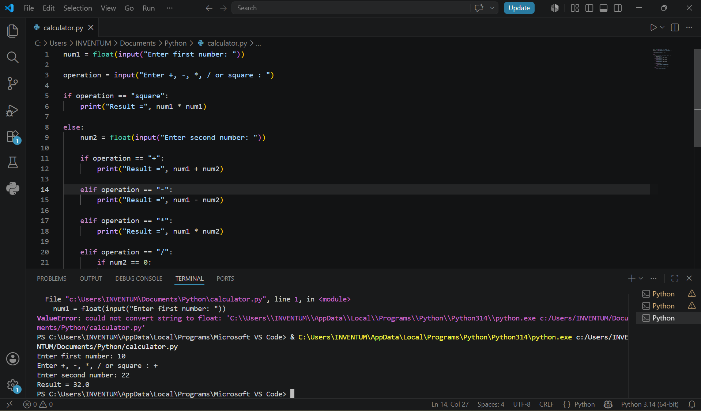

# Python Calculator

My first Python project.

## Features
- Addition
- Subtraction
- Multiplication
- Division
- Square of a Number

## Concepts Used
- Variables
- Input/Output
- If-Else Statements

## Output Screenshot

## Author
Ashwini Shanbhag
